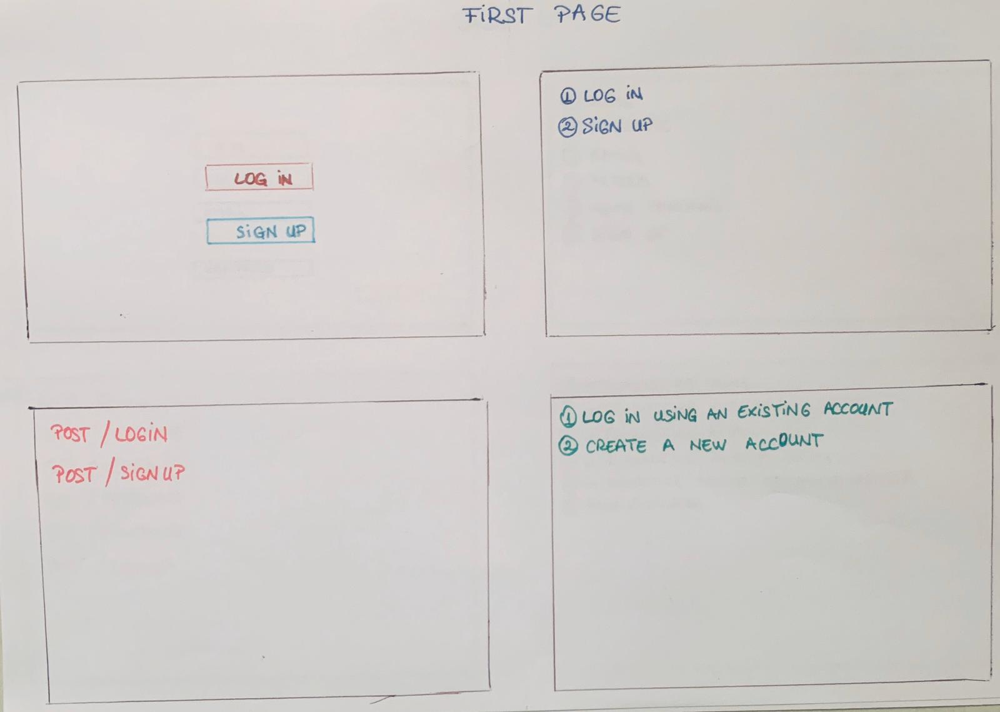
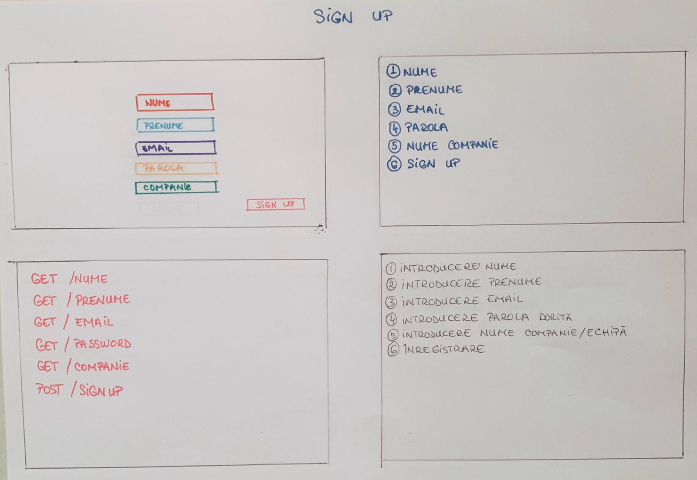
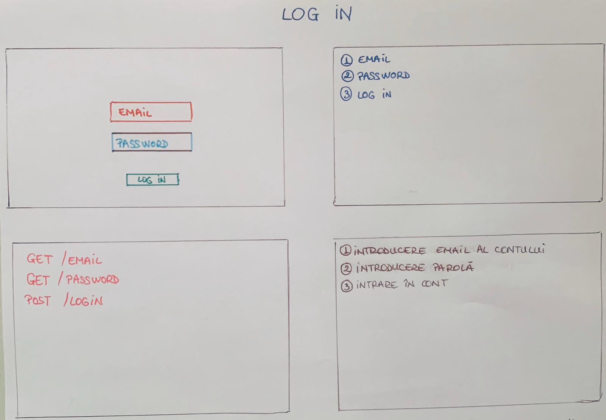
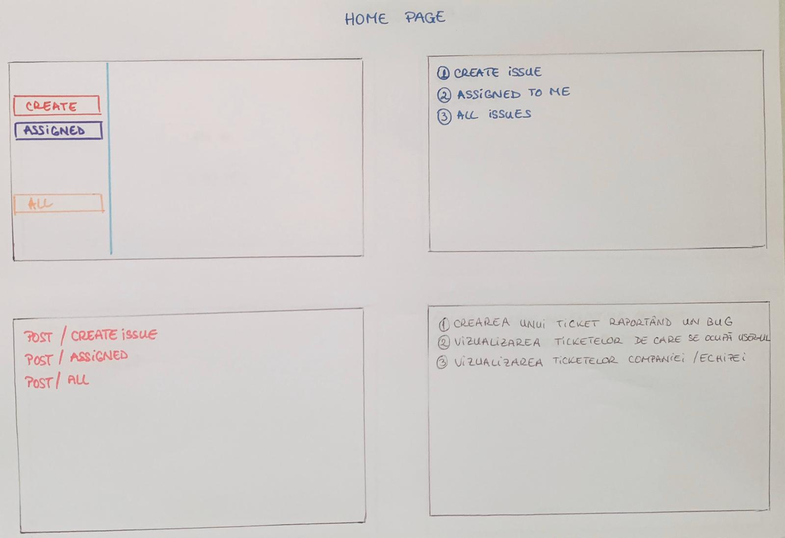
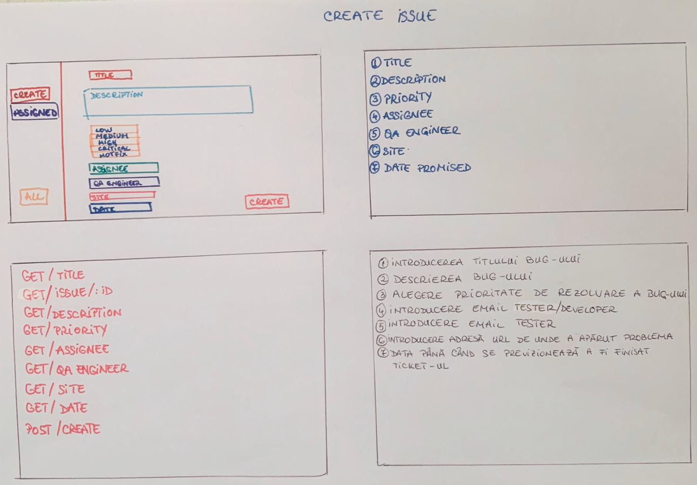

<!DOCTYPE html>
<html>
<head>
</head>
<body>
    <h3>Aplicație web pentru gestionarea rezolvării bug-urilor: Bye bye oversighting </h3>
	<h4>Introducere:</h4>
	
Un bug reprezintă o disfuncționalitate a unui sistem informatic (hardware sau software), disfuncţionalitate cauzată, cel mai adesea, de o eroare/omisiune în proiectare şi sesizată ulterior fie de către utilizatorii sistemului respectiv, fie chiar de către producător. 

<h4>De ce apar erori, bug-uri la nivel de software?</h4>

Deoarece nu există niciun algoritm sau vreo teorema matematică, care să asigure implementarea corectă a unui program și funcționarea corespunzătoare a acestuia. Așadar, este nevoie de testare că proces pentru a evalua nivelul de corectitudine al programului.
Bug-ul, în orice software de larg consum, e o constantă favorizată de mai mulți factori.
Un factor principal, este cel uman. Software-ul este scris de oameni, iar aceștia pot face greșeli, ceea ce poate determina o eroare la nivel de software. Există proceduri de test pentru software, dar în prea puține cazuri acestea pot acoperi toată gama valorilor sau situațiilor de intrare.
O problemă mai delicată însă este decuplarea tot mai accentuată a software-ului de hardware. Programatorii de azi nu au nevoie să știe prea multe despre sistemele pentru care scriu. O mare parte a detaliilor specifice este mascată de diverse biblioteci sau apeluri de sistem. Din cauza asta, unele presupuneri, s-ar putea dovedi false atunci când trecem de la sisteme de tip PC la embedded.

<h4>Obiectivul nostru este de a realiza o aplicație  web care să permită gestionarea bug-urilor. În termeni mai exacți , aceasta va include următoarele funcțiuni:</h4>
<dt>1. Logarea sau crearea unui nou cont.</dt>

2.Utilizatorul aplicației (tester/dezvoltator) își va crea un bilet (ticket) care se va deschide sub forma unui formular. Câmpurile formularului vor include:

<ol>
<li>Titlul bug-ului</li>
<li>Descrierea acestuia</li>
<ol>
<li>Low->necesită rezolvarea bug-ului în câteva săptămâni,zile</li>
<li> Medium->necesita rezolvarea bug-ului in cateva zile./li>
<li>High->necesită rezolvarea bug-ului în 2-3 zile</li>
<li>Critical->necesită rezolvarea bug-ului într-o zi</li>
<li>Hotfix->necesită rezolvarea bug-ului în cateva ore</li>

</ol>
<li>Assignee - un edittext, ce va permite introducerea adresei de e-mail a tester-ului sau a dezvoltatorului. În cazul în care ticket-ul a fost creat de către un tester, acesta va indica e-mail-ul(username-ul)  unui dezvoltator, care va verifica din ce cauză a apărut bug-ul. În urma verificării și fixării , programatorul va completa ticket-ul cu un comentariu și va indica din nou în zona “Assignee” username-ul tester-ului care se va asigură că problema a dispărut.
</li>
<li>QA Engineer - un edittext , ce va permite introducerea de e-mail doar a tester-ului. Pe parcursul testării , acest câmp poate fi modificat cu introducerea a unui alt username.
</li>
<li>Sites - posibilitatea de introducere a unei adrese URL de unde a aparut problema.
</li>
<li>Date Promised - data până când se previzionează a fi finisat ticket-ul.
</li>
</ol>

3.În urma completării formularelor de creare a biletelor , acestea vor fi identificate după un ID. În urma accesării lor, se va deschide o pagina web ce va cuprinde toate datele create și menționate mai sus .
 Alte funcționalități care vor fi vizibile aici, vor fi :
 <dt> 1)Status:</dt>
 <ol>
 <li> To Do -> biletul a fost creat , urmează a fi testat</li>
 <li>  In progress-> se testează de către tester</li>
 <li>  In reviews-> se testează de către programator</li>
 <li> Done-> bug-ul a fost soluționat, se inchide biletul</li>
 </ol>
 <dt>2) Adăugare de comentarii.</dt>
 

 
4. Baze de date,MySQL.
  Aplicația care urmează a fi creată se va adresa unui grup de utilizatori (companii,echipe de dezvoltare). Aceștia  își vor introduce în formularul de sign up denumirea companiei sau echipei din care fac parte, astfel având acces privat la bug-urile raportate. 

Alte produse similare pe piața sunt: Jira Software, Launchpad, Bugzilla, Trac, Sourceforge, Roundup, Mantis, RT, Debian BTS și BugNet.

 <h3>Imagini </h3>
 <li> 1. </li>
   
<li> 2. </li>
  
<li> 3. </li>
   
<li> 4. </li>
   
<li> 5. </li>
   

</body>

</html>
